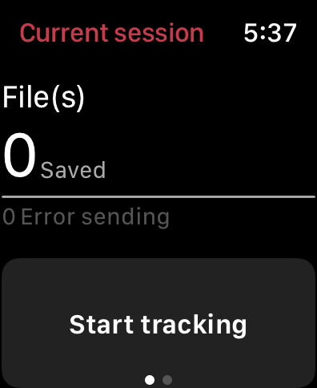
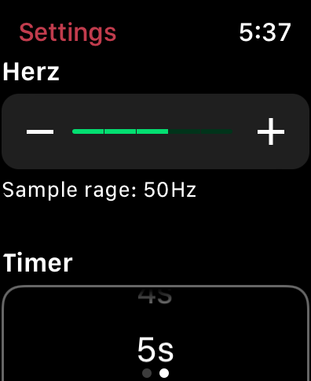
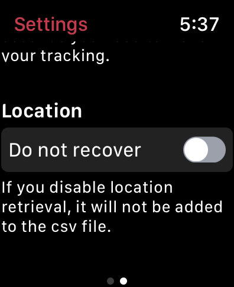
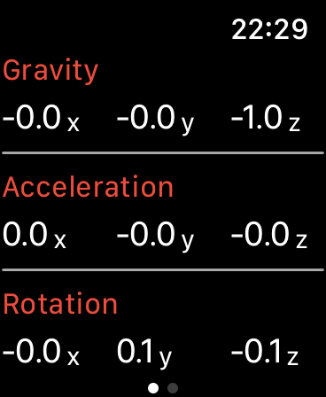
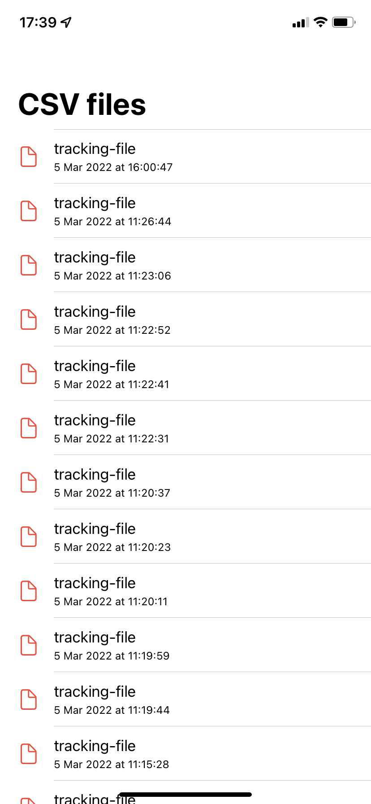
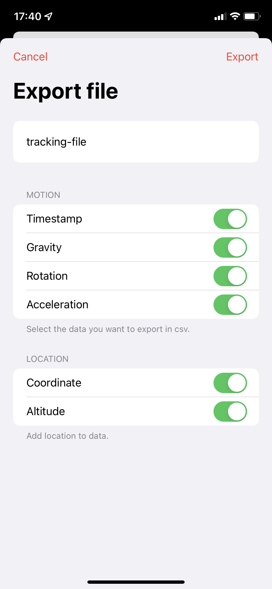

# MotionTracking

This application refers to the article, [Introduction to Apple WatchKit with Core Motion — Tracking Jumping Jacks](https://heartbeat.comet.ml/introduction-to-apple-watchkit-with-core-motion-tracking-jumping-jacks-259ee80d1210) by Eric Hsiao.
It collect in a csv file the movement and location data of the Apple Watch, that will allow the creation of ML models so that your Apple Watch recognizes movements using the Core ML framework.

The Application uses CoreMotion and LocationManager to collect the data and saves it to a file that is transferred to the iPhone using WatchConnectivity, then, you can export the data to a csv file from the iPhone.


## Screenshots

### Apple Watch 
   

### iPhone
 


## Features

### Apple Watch
- [x] Change sample interval
- [x] Change timer of tracking
- [x] Add or remove the location position to csv

### iPhone
- [x] Export of csv files
- [x] Delete of csv files
- [x] Choice of data to export (Timestamp, gravity, rotation, acceleration, coordinate, altitude)
- [x] Export multiple files in zip format


## ToDo

- [x] Delete multiple files at once
- [x] Create group files
- [x] Organize your csv files to export to Create ML


## Requirements

- iOS 14.0+
- wachtOS 8.0+
- Xcode 13.2.1


## Build

Project uses CocoaPods for dependencies management. To build the project you need to download dependencies:

```
pod install
```


## Author

k.angama, karim.angama@gmail.com


## License

MotionTracking is available under the MIT license. See the [LICENSE](https://github.com/k-angama/MotionTracking/blob/master/LICENSE) file for more info.
